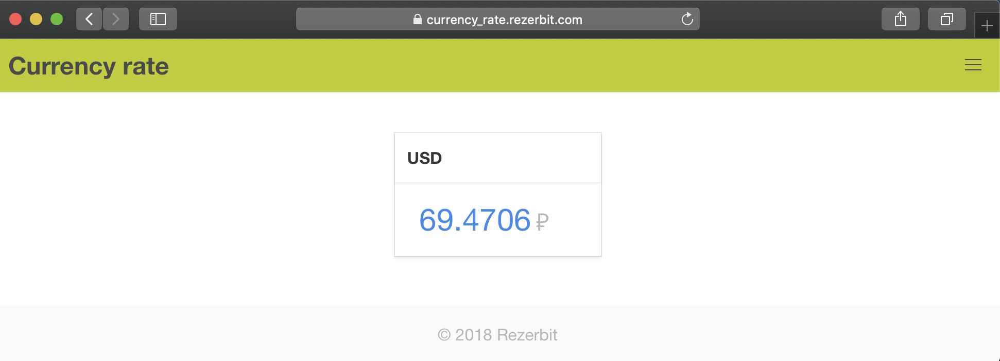

# currency_rate

📈The application which fetches, stores and displays currency exchange rate.

[](https://drone.rezerbit.com/rezerbit/currency_rate)
[](https://www.codacy.com/app/rezerbit/currency_rate?utm_source=github.com&amp;utm_medium=referral&amp;utm_content=rezerbit/currency_rate&amp;utm_campaign=Badge_Grade)
[](https://codecov.io/gh/rezerbit/currency_rate)

Demo: https://currency_rate.rezerbit.com/



## Development

```bash
docker compose up
docker exec -ti currency_rate-app bash
```

## Deploy

Build and push images

```
cd docker && ./build_and_push.sh
```

On server:

```
cd docker
vim .env.prod
./deploy.sh
```

# License
MIT
